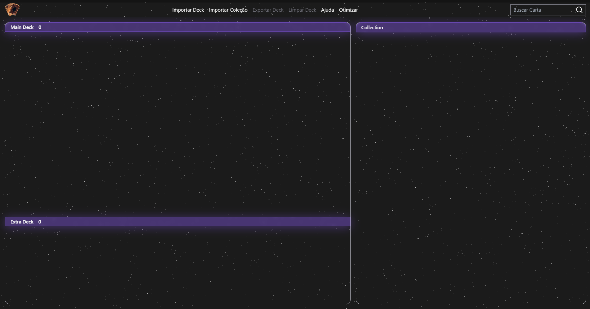

   

# Yu Gi Oh Deck Builder

This project is designed to help Yu-Gi-Oh! players build decks more easily by using data from existing websites. It allows users to create new decks, import their card collections, and view detailed card stats. With these features, players can efficiently manage their cards and make better deck-building decisions when playing with friends.

## Getting Started

These instructions will get you a copy of the project up and running on your local machine for development and testing purposes. (PENSAR SE VAI REMOVER)See deployment for notes on how to deploy the project on a live system.

### Prerequisites

To run this project you must have NodeJs v20.17.0 (or higher) installed. To do so, please head to their website [NodeJs](https://nodejs.org/)

### Installing

First you need to clone this project

```
git clone https://github.com/filipeoliveira-oss/ygoDeckBuilder.git
```

once you have it cloned, run this command in the root of the repository

```
npm install
```

once installed, run

```
npm run dev
```

Done, you have your Dev Environment up and running.



## Built With

* [React](https://react.dev/) - The library for web and native user interfaces
* [TypeScript](https://www.typescriptlang.org/) - Strongly typed programming language that builds on JavaScrip
* [YGOProdeck](https://ygoprodeck.com/) - A Yu Gi Oh Community
* [Axios](https://axios-http.com/) - Promise based HTTP client for the browser and node.js
* [Framer Motion](https://www.framer.com/motion/) - Framer Motion animation library
* [Radix-ui](https://www.radix-ui.com/primitives) - A component library
* [papaparse](https://www.papaparse.com/) -  Powerful CSV Parser for JavaScript
* [file-saver](https://github.com/eligrey/FileSaver.js#readme) - Solution to saving files on the client-side

## Acknowledgments

* I’m incredibly grateful to all my friends who inspired me to create this solution for our game.
* A huge thanks to all the creators of the technologies used, more specially for YGO Pro Deck to make this website possible due to it's [API](https://ygoprodeck.com/api-guide/) and a ton of other features in their website

## Contact

If this project helped you in any way or if you just want to talk and give ideas to this project, please feel free to contact me

[](https://www.linkedin.com/in/filipeoliveirasilva/)
